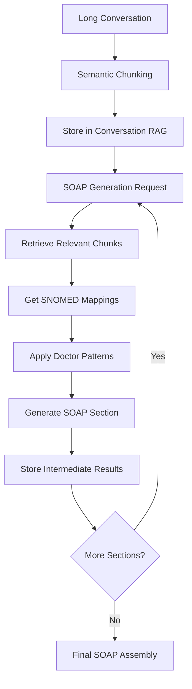

# RAG Architecture for Medical SOAP Notes System

## Overview

This document defines the Retrieval-Augmented Generation (RAG) architecture for handling long medical conversations, SNOMED code mapping, and doctor pattern learning.

## Three-Tier RAG System

### 1. Conversation RAG (Sensitive Data)
**Purpose**: Store and retrieve patient-doctor conversations with privacy protection

**Technical Specifications**:
- **Vector Database**: Weaviate with medical schema
- **Embedding Model**: Medical-specific embeddings (BioBERT-based)
- **Chunking Strategy**: Semantic chunking by medical topics
- **Security**: End-to-end encryption, access controls
- **Retention**: Configurable data retention policies

**Chunking Strategy**:
```python
# Semantic chunking approach
def chunk_conversation(conversation: str) -> List[Chunk]:
    # 1. Identify medical topics/sections
    # 2. Create overlapping chunks (200-300 tokens)
    # 3. Maintain context continuity
    # 4. Add metadata (timestamp, participants, topic)
    pass
```

**Data Structure**:
```json
{
  "chunk_id": "conv_123_chunk_1",
  "conversation_id": "conv_123",
  "content": "Patient reports chest pain...",
  "metadata": {
    "timestamp": "2024-01-15T10:30:00Z",
    "speaker": "patient",
    "medical_topic": "chief_complaint",
    "chunk_index": 1,
    "overlap_with": ["conv_123_chunk_0", "conv_123_chunk_2"]
  },
  "embedding": [0.1, 0.2, ...],
  "security_level": "highly_sensitive"
}
```

### 2. SNOMED RAG (Medical Knowledge)
**Purpose**: Map medical terms to SNOMED Canadian edition codes

**Technical Specifications**:
- **Data Source**: SNOMED CT Canadian Edition
- **Languages**: English and French
- **Update Frequency**: Quarterly SNOMED releases
- **Search Type**: Semantic + exact match hybrid

**Data Structure**:
```json
{
  "snomed_id": "38341003",
  "preferred_term": "Hypertensive disorder",
  "synonyms": ["High blood pressure", "HTN", "Hypertension"],
  "french_terms": ["Hypertension artérielle", "HTA"],
  "category": "disorder",
  "parent_concepts": ["49601007"],
  "child_concepts": ["10725009", "48146000"],
  "embedding": [0.3, 0.4, ...],
  "usage_frequency": 0.85
}
```

### 3. Pattern Learning RAG (Doctor Preferences)
**Purpose**: Learn and apply doctor-specific terminology preferences

**Technical Specifications**:
- **Learning Method**: Feedback-based pattern extraction
- **Confidence Scoring**: Frequency and recency weighted
- **Context Awareness**: Section-specific preferences
- **Validation**: Human-in-the-loop confirmation

**Data Structure**:
```json
{
  "pattern_id": "doc_123_pattern_45",
  "doctor_id": "doc_123",
  "original_term": "Hypertensive disorder",
  "preferred_term": "HTN",
  "context": {
    "soap_section": "assessment",
    "medical_specialty": "cardiology",
    "patient_age_group": "adult"
  },
  "confidence": 0.92,
  "frequency": 18,
  "last_updated": "2024-01-15T14:20:00Z",
  "validation_status": "confirmed",
  "embedding": [0.5, 0.6, ...]
}
```

## RAG Integration Workflow

### For Long Conversations



### Retrieval Strategy

**Hierarchical Retrieval**:
1. **Level 1**: Retrieve conversation chunks relevant to SOAP section
2. **Level 2**: Get SNOMED mappings for medical terms
3. **Level 3**: Apply doctor-specific patterns

**Query Optimization**:
```python
def retrieve_for_soap_section(
    section: str, 
    conversation_id: str, 
    doctor_id: str,
    previous_sections: Dict[str, str]
) -> RetrievalResult:
    # 1. Build section-specific query
    # 2. Retrieve relevant conversation chunks
    # 3. Get SNOMED mappings
    # 4. Apply doctor patterns
    # 5. Rank and filter results
    pass
```

## Performance Optimization

### Caching Strategy
- **Embedding Cache**: Cache computed embeddings
- **SNOMED Cache**: Cache frequent medical term lookups
- **Pattern Cache**: Cache doctor preferences per session

### Parallel Processing
- **Concurrent Retrieval**: Query multiple RAGs simultaneously
- **Batch Processing**: Process multiple chunks in parallel
- **Async Operations**: Non-blocking RAG operations

## Security Implementation

### Access Control
```python
class RAGSecurityManager:
    def check_access(self, user_id: str, resource_type: str, resource_id: str) -> bool:
        # Implement RBAC for RAG access
        pass
    
    def encrypt_sensitive_data(self, data: str) -> str:
        # AES-256 encryption for sensitive content
        pass
    
    def audit_access(self, user_id: str, action: str, resource: str):
        # Log all RAG access for compliance
        pass
```

### Data Anonymization
- **PII Removal**: Automatic detection and masking
- **Pseudonymization**: Replace identifiers with tokens
- **Differential Privacy**: Add noise to protect individual privacy

## Monitoring and Metrics

### Key Performance Indicators
- **Retrieval Accuracy**: Relevance of retrieved chunks
- **Response Time**: Query execution time
- **Cache Hit Rate**: Efficiency of caching
- **Pattern Learning Rate**: Speed of preference adaptation

### Alerting Thresholds
- Retrieval latency > 500ms
- Cache hit rate < 80%
- Pattern confidence < 0.7
- Security violations detected

## Implementation Guidelines

### RAG Service Interface
```python
class RAGService:
    async def store_conversation(self, conversation: Conversation) -> str:
        """Store conversation with chunking and encryption"""
        pass
    
    async def retrieve_for_soap(
        self, 
        query: str, 
        section: str, 
        doctor_id: str
    ) -> List[RetrievalResult]:
        """Retrieve relevant information for SOAP generation"""
        pass
    
    async def learn_pattern(
        self, 
        doctor_id: str, 
        original: str, 
        preferred: str, 
        context: Dict
    ):
        """Learn doctor preference pattern"""
        pass
```

### Error Handling
- **Graceful Degradation**: Fallback to basic retrieval
- **Retry Logic**: Exponential backoff for failures
- **Circuit Breaker**: Prevent cascade failures

## Testing Strategy

### Unit Tests
- Individual RAG service functionality
- Chunking algorithm accuracy
- Pattern learning logic

### Integration Tests
- Multi-RAG coordination
- End-to-end retrieval workflow
- Security and access control

### Performance Tests
- Load testing with concurrent queries
- Latency benchmarking
- Memory usage optimization

## Deployment Considerations

### Scaling Strategy
- **Horizontal Scaling**: Multiple RAG service instances
- **Data Partitioning**: Distribute data across nodes
- **Load Balancing**: Distribute queries efficiently

### Backup and Recovery
- **Regular Backups**: Automated vector database backups
- **Disaster Recovery**: Multi-region replication
- **Data Integrity**: Checksums and validation

## Future Enhancements

### Advanced Features
- **Multi-modal RAG**: Support for images and audio
- **Federated Learning**: Distributed pattern learning
- **Real-time Updates**: Streaming data ingestion
- **Advanced Analytics**: Usage pattern analysis

### Optimization Opportunities
- **Custom Embeddings**: Fine-tuned medical embeddings
- **Hybrid Search**: Combine vector and keyword search
- **Adaptive Chunking**: Dynamic chunk size optimization
- **Intelligent Caching**: ML-based cache management
