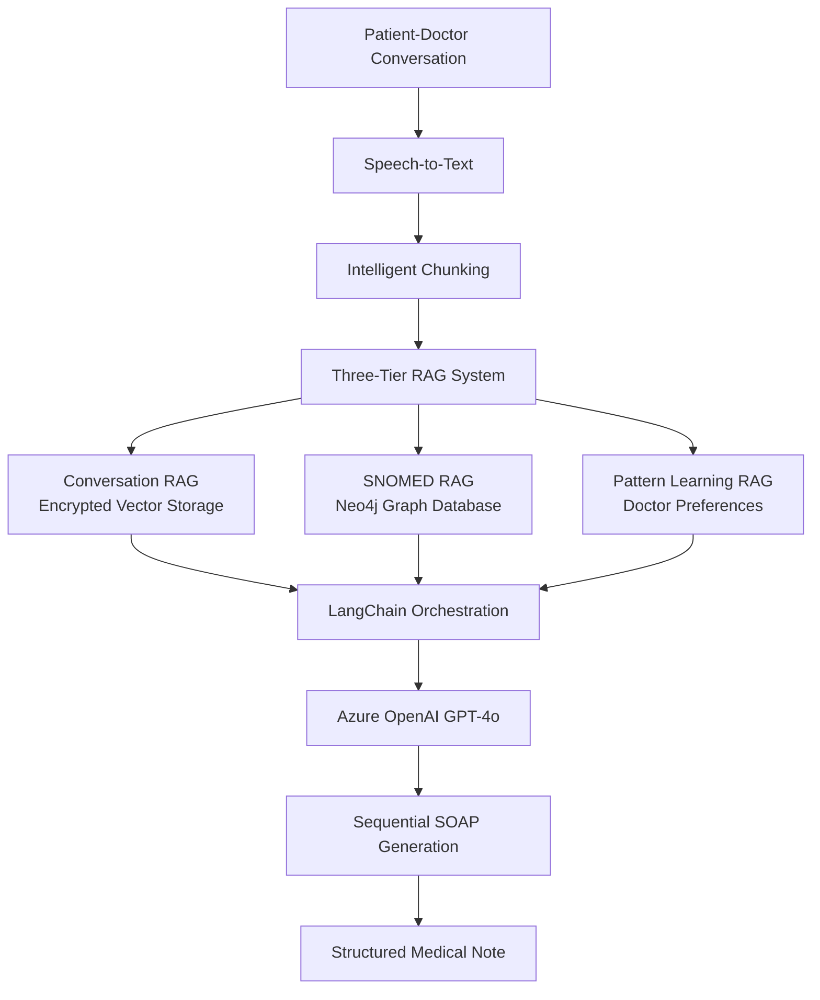
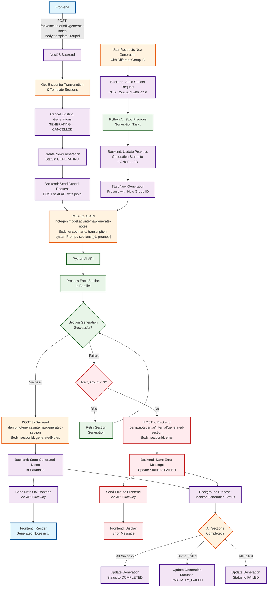

# NoteGen AI APIs

Medical SOAP note generation microservice using AI and RAG systems. This service processes medical conversations and generates structured SOAP notes with chunk references for transparency and traceability.

## 🚀 Features

- **Real-time SOAP Generation**: Process medical conversations and generate SOAP sections sequentially
- **RAG-Enhanced Processing**: Uses conversation chunks and SNOMED knowledge graph for accuracy
- **Doctor Pattern Learning**: Adapts to individual doctor preferences over time
- **Chunk Referencing**: Returns conversation chunk IDs for transparency and safety
- **Multi-language Support**: English and French medical terminology
- **SNOMED Integration**: Canadian edition SNOMED codes for medical term validation

## 📋 API Flow

**Updated Pipeline:**

1. **Input from NestJS**: Receives prompts array, conversation ID, speaker-aware transcription, and doctor ID
2. **Conversation Storage**: Saves conversation to Vector RAG with unique conversation ID
3. **Comprehensive Medical Term Extraction**: Extracts all medical terms from the full transcript using LLM
4. **Global SNOMED Mapping**: Maps all extracted terms to SNOMED Canadian edition codes (Neo4j)
5. **Section Generation**: Generates all requested sections using RAG context, global SNOMED mappings, and doctor preferences
6. **Traceability**: Returns line references and SNOMED mappings for every section
7. **Immediate Response**: Sends each completed section back to NestJS immediately

## 🏗️ Architecture

### Core Components



## 🛠 Installation

### Prerequisites
- Python 3.11+
- Poetry for dependency management
- Neo4j with SNOMED data (pre-existing)

### Setup
```bash
# Install dependencies
make install

# Start development server
make dev

# Run tests
make test
```

## 📊 API Endpoints

### Main Processing Endpoint

**POST** `/internal/soap/process-conversation`

Processes conversation from NestJS and generates SOAP sections.

**Request Body:**
```json
{
  "prompts": [
    {
      "id": "1",
      "code": "MAIN_GENERATION_SECTIONS_PROMPT", 
      "prompt": "Generate ${sectionPrompt} based on conversation"
    },
    {
      "id": "2", 
      "code": "SYSTEM_PROMPT",
      "prompt": "You are a medical professional..."
    }
  ],
  "conversation_id": "conv_12345",
  "transcription_text": "Doctor: How are you feeling? Patient: I have chest pain...",
  "doctor_id": "doc_456",
  "language": "en"
}
```

**Response (First Section - Subjective):**
```json
{
  "section_type": "subjective",
  "section_content": "Patient reports chest pain that started yesterday evening...",
  "section_id": "section_subjective_a1b2c3d4",
  "conversation_id": "conv_12345",
  "chunk_references": [
    {
      "chunk_id": "chunk_1",
      "chunk_content": "Patient reports chest pain...",
      "similarity_score": 0.95,
      "start_position": 0,
      "end_position": 50
    }
  ],
  "snomed_mappings": [
    {
      "concept_id": "...",
      "preferred_term": "...",
      "original_term": "...",
      "confidence": 0.98,
      "language_code": "en"
    }
  ],
  "confidence_score": 0.85,
  "processing_metadata": {
    "chunks_used": 2,
    "snomed_codes_found": 1,
    "doctor_preferences_applied": 1,
    "processing_time_ms": 1250,
    "medical_terms_extracted": 3
  },
  "created_at": "2024-01-15T10:30:00Z"
}
```


### Additional Endpoints

- **GET** `/internal/soap/processing-status/{conversation_id}` - Get processing status
- **POST** `/internal/soap/store-conversation` - Store conversation in RAG
- **POST** `/internal/soap/generate-section` - Generate specific section
- **GET** `/health` - Health check

## 🏗 Architecture

### Core Components
- **FastAPI Backend**: Async API with dependency injection
- **Conversation RAG**: Vector database for conversation chunks
- **SNOMED RAG**: Neo4j knowledge graph with Canadian SNOMED codes
- **Pattern Learning**: Doctor preference adaptation system
- **SOAP Generator**: AI-powered section generation

### Data Flow
```
NestJS → Python API → Save Conversation → Generate SOAP Sections → 
Neo4j SNOMED Mapping → Vector RAG Retrieval → Section Response → NestJS
```

## 🧪 Testing

All tests are passing (53/53):

```bash
# Run all tests
poetry run pytest tests/unit/ -v

# Run specific service tests
poetry run pytest tests/unit/test_soap_generator.py -v
poetry run pytest tests/unit/test_conversation_rag.py -v  
poetry run pytest tests/unit/test_snomed_rag.py -v
```

## 📝 Example Usage

### Processing a Medical Conversation

```python
import httpx

# Prepare request data matching CSV prompts structure
request_data = {
    "prompts": [
        {
            "id": "1",
            "code": "MAIN_GENERATION_SECTIONS_PROMPT",
            "prompt": "Generate ${sectionPrompt} based on the medical conversation provided. Focus on extracting relevant medical information for this section."
        },
        {
            "id": "2", 
            "code": "SYSTEM_PROMPT",
            "prompt": "You are a medical documentation specialist. Generate accurate, professional medical notes following SOAP format standards."
        }
    ],
    "conversation_id": "conv_20240115_001",
    "transcription_text": """
    Doctor: Good morning, how are you feeling today?
    Patient: I've been having chest pain since yesterday evening.
    Doctor: Can you describe the pain?
    Patient: It's sharp and located in the center of my chest. Gets worse when I breathe deeply.
    Doctor: Any shortness of breath or nausea?
    Patient: No, just the chest pain.
    """,
    "doctor_id": "dr_smith_123",
    "language": "en"
}

# Send request
async with httpx.AsyncClient() as client:
    response = await client.post(
        "http://localhost:8000/internal/soap/process-conversation",
        json=request_data
    )
    
    subjective_section = response.json()
    print(f"Generated: {subjective_section['section_type']}")
    print(f"Content: {subjective_section['section_content']}")
    print(f"Chunks used: {len(subjective_section['chunk_references'])}")
```

### Checking Processing Status

```python
# Check if all sections are completed
status_response = await client.get(
    f"http://localhost:8000/internal/soap/processing-status/{conversation_id}"
)

status = status_response.json()
print(f"Status: {status['status']}")
print(f"Progress: {status['progress_percentage']}%")
print(f"Completed: {status['sections_completed']}")
print(f"Pending: {status['sections_pending']}")
```

## 🔧 Configuration

Key environment variables:

```bash
# Azure OpenAI
# AZURE_OPENAI_API_KEY=***
# AZURE_OPENAI_ENDPOINT=***
# AZURE_OPENAI_DEPLOYMENT_NAME=***

# Neo4j (SNOMED)
# NEO4J_URI=***
# NEO4J_USERNAME=***
# NEO4J_PASSWORD=***

# CORS
# CORS_ORIGINS=***

# Application
# API_HOST=127.0.0.1
# API_PORT=8000
# DEBUG=false
```

## 🚦 Health Check

```bash
curl http://localhost:8000/health
```

## 📚 Documentation

- **API Docs**: http://localhost:8000/docs (Swagger UI)
- **ReDoc**: http://localhost:8000/redoc
- **OpenAPI**: http://localhost:8000/openapi.json

## 🔒 Security

- **Data Encryption**: All conversation data encrypted at rest
- **Access Control**: RBAC with fine-grained permissions  
- **Audit Logging**: Complete access trail for compliance
- **HIPAA/PIPEDA**: Compliance-ready architecture

## 🎯 Key Benefits

1. **Transparency**: Chunk references show exactly which conversation parts were used
2. **Accuracy**: SNOMED integration ensures medical term validation
3. **Adaptability**: Learns doctor preferences over time
4. **Scalability**: Async processing with dependency injection
5. **Compliance**: Built for healthcare data protection standards

---

**Status**: ✅ All tests passing (53/53) | Production-ready medical SOAP generation microservice

## 🐳 Docker Deployment

To build and run this service as a Docker container, follow these steps:

1.  **Build the Docker Image:**
    Use the `make` command to build the image. This will use the `Dockerfile` in the root of the project.

    ```bash
    make docker-build
    ```

2.  **Run the Docker Container:**
    After the image is built, you can run it as a container. Make sure you have a `.env` file with the required environment variables in the root of the project, as it will be passed to the container.

    ```bash
    make docker-run
    ```
    The application will be available at `http://localhost:8000`.

## Infrastructure as Code (Terraform)

All infrastructure for this project is managed using Terraform and is located in the `terraform/` directory at the root of the repository. The structure is as follows:

```
terraform/
  modules/        # Reusable Terraform modules (e.g., vpc, ecs_service, neo4j, opensearch)
  envs/           # Environment-specific configurations (e.g., prod, staging)
    prod/
    staging/
```

- Use `modules/` for generic, reusable building blocks.
- Use `envs/` for environment-specific instantiations of modules and configuration.
- State files and backend configuration are kept per environment in `envs/<env>/`.

See `docs/devops_deployment_plan.md` for more details.
# OIDC CI/CD Pipeline Ready
# OIDC trust policy updated for multi-job support
