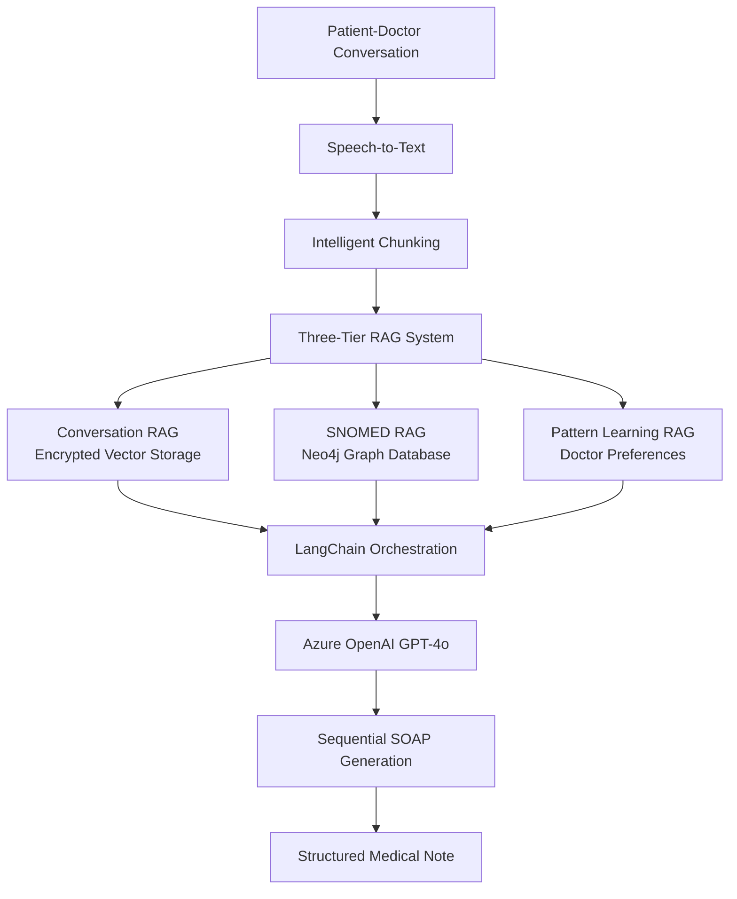

# NoteGen AI APIs

> **Medical SOAP Note Generation System using AI and RAG Architecture**

A sophisticated AI-powered system that converts patient-doctor conversations into structured SOAP (Subjective, Objective, Assessment, Plan) notes using advanced RAG (Retrieval-Augmented Generation) architecture with LangChain, Azure OpenAI GPT-4o, and Neo4j.

## 🏥 System Overview

This system addresses the challenge of converting long patient-doctor conversations (1-2 hours) into structured medical documentation while maintaining accuracy, compliance, and efficiency.

### Key Features

- **🎯 Sequential SOAP Generation**: S → O → A → P → Keywords
- **🧠 Three-Tier RAG System**: Conversation RAG, SNOMED RAG, Pattern Learning
- **🔒 HIPAA/PIPEDA Compliant**: End-to-end encryption and audit logging
- **📊 Intelligent Chunking**: 60-80% token reduction for long conversations
- **🎨 Pattern Learning**: Adapts to doctor preferences (e.g., "Hypertension" → "HTN")
- **📈 Real-time Observability**: LangFuse integration for monitoring and tracing

## 🏗️ Architecture

### Core Components



### Technology Stack

| Component | Technology | Purpose |
|-----------|------------|---------|
| **Backend API** | FastAPI + Python 3.11+ | REST API endpoints |
| **AI Orchestration** | LangChain | RAG system coordination |
| **LLM** | Azure OpenAI GPT-4o | Medical text generation |
| **Vector Database** | ChromaDB/Weaviate | Conversation embeddings |
| **Graph Database** | Neo4j | SNOMED Canadian edition |
| **Observability** | LangFuse | AI system monitoring |
| **Security** | AES-256 + RBAC | Medical data protection |
| **Environment** | Poetry | Dependency management |

## 🚀 Quick Start

### Prerequisites

- **Python 3.11+**
- **Poetry** for dependency management
- **Docker** for Neo4j and vector databases
- **Azure OpenAI** account with GPT-4o deployment
- **LangFuse** account for observability

### Installation

1. **Clone and setup environment:**
   ```bash
   git clone <repository-url>
   cd notegen-ai-apis
   make dev-setup
   ```

2. **Configure environment variables:**
   ```bash
   cp .env.example .env
   # Edit .env with your actual configuration
   ```

3. **Start services:**
   ```bash
   make docker-up
   make run-dev
   ```

4. **Verify installation:**
   ```bash
   make health-check
   ```

## ⚙️ Configuration

### Environment Variables

Create a `.env` file with the following configuration:

```bash
# Azure OpenAI Configuration
AZURE_OPENAI_API_KEY=your_azure_openai_api_key
AZURE_OPENAI_ENDPOINT=https://your-instance.openai.azure.com
AZURE_OPENAI_DEPLOYMENT_NAME=gpt-4o
AZURE_OPENAI_API_VERSION=2024-05-01-preview

# Neo4j Configuration (SNOMED RAG)
NEO4J_URI=bolt://localhost:7687
NEO4J_USERNAME=neo4j
NEO4J_PASSWORD=your_neo4j_password
NEO4J_DATABASE=neo4j

# LangFuse Configuration (Observability)
LANGFUSE_SECRET_KEY=sk-lf-9547c655-5f43-43fc-a34e-88d37209e272
LANGFUSE_PUBLIC_KEY=pk-lf-a08b3616-851f-4650-9c6a-1769d66b859f
LANGFUSE_HOST=https://us.cloud.langfuse.com

# Vector Database
CHROMA_PERSIST_DIRECTORY=./chroma_db
WEAVIATE_URL=http://localhost:8080

# Security
ENCRYPTION_KEY=your_32_byte_encryption_key
JWT_SECRET_KEY=your_jwt_secret_key
```

### Docker Services

The system uses Docker Compose for external services:

```yaml
# docker-compose.yml
services:
  neo4j:
    image: neo4j:5.15
    ports:
      - "7474:7474"
      - "7687:7687"
    environment:
      NEO4J_AUTH: neo4j/your_password
      
  weaviate:
    image: semitechnologies/weaviate:latest
    ports:
      - "8080:8080"
```

## 🔧 Development

### Available Commands

```bash
# Development
make run-dev          # Start development server with hot reload
make test             # Run all tests
make test-cov         # Run tests with coverage
make lint             # Run code linting
make format           # Format code

# Docker Services
make docker-up        # Start Neo4j and vector databases
make docker-down      # Stop all services
make docker-logs      # View service logs

# Database Operations
make db-setup         # Initialize databases
make db-migrate       # Run migrations

# Code Quality
make check            # Run all quality checks
make security         # Run security scans
make audit            # Audit dependencies

# Maintenance
make clean            # Clean cache and temp files
make dev-reset        # Reset development environment
```

### Project Structure

```
notegen-ai-apis/
├── app/
│   ├── main.py                 # FastAPI application entry point
│   ├── api/
│   │   ├── endpoints/          # API route handlers
│   │   └── dependencies.py     # Dependency injection
│   ├── services/
│   │   ├── soap_generation.py  # SOAP note generation service
│   │   ├── conversation_rag.py # Conversation RAG system
│   │   ├── snomed_rag.py      # SNOMED terminology RAG
│   │   └── pattern_learning.py # Doctor preference learning
│   ├── models/
│   │   ├── soap.py            # SOAP note data models
│   │   └── conversation.py    # Conversation data models
│   ├── core/
│   │   ├── config.py          # Configuration management
│   │   ├── security.py        # Security utilities
│   │   └── observability.py   # LangFuse integration
│   └── utils/
│       ├── chunking.py        # Intelligent text chunking
│       └── encryption.py      # Data encryption utilities
├── tests/
│   ├── unit/                  # Unit tests
│   ├── integration/           # Integration tests
│   └── performance/           # Performance tests
├── scripts/
│   ├── setup_databases.py     # Database initialization
│   └── migrate_databases.py   # Database migrations
├── docs/                      # Documentation
├── .cursor/rules/             # Cursor AI rules and guidelines
├── docker-compose.yml         # Docker services configuration
├── pyproject.toml            # Poetry dependencies
├── Makefile                  # Development automation
└── README.md                 # This file
```

## 🔒 Security & Compliance

### Medical Data Protection

- **Encryption**: AES-256 encryption for all patient data
- **Access Control**: Role-based access control (RBAC)
- **Audit Logging**: Comprehensive audit trail for all data access
- **Compliance**: HIPAA and PIPEDA compliant architecture

### Security Features

```python
# Example: Encrypted conversation storage
from app.core.security import encrypt_patient_data, decrypt_patient_data

# Encrypt before storing
encrypted_conversation = encrypt_patient_data(conversation_text)
vector_store.add_document(encrypted_conversation)

# Decrypt for processing
decrypted_text = decrypt_patient_data(encrypted_conversation)
```

## 📊 Observability

### LangFuse Integration

The system includes comprehensive observability through LangFuse:

```python
from langfuse.decorators import observe
from langfuse import Langfuse

# Initialize LangFuse
langfuse = Langfuse(
    secret_key="sk-lf-9547c655-5f43-43fc-a34e-88d37209e272",
    public_key="pk-lf-a08b3616-851f-4650-9c6a-1769d66b859f",
    host="https://us.cloud.langfuse.com"
)

@observe(name="soap_generation")
async def generate_soap_note(conversation: str) -> dict:
    """Generate SOAP note with full tracing"""
    # Implementation with automatic tracing
```

### Monitoring Dashboards

- **LangFuse Dashboard**: https://us.cloud.langfuse.com
- **API Metrics**: Token usage, response times, error rates
- **Quality Metrics**: SOAP note accuracy, completeness scores
- **Performance**: Chunking efficiency, RAG retrieval accuracy

## 🧪 Testing

### Test Categories

```bash
# Unit Tests
make test                    # All unit tests
pytest tests/unit/          # Specific unit tests

# Integration Tests
pytest tests/integration/   # Database and API integration

# Performance Tests
make perf-test              # Performance benchmarks
make load-test              # Load testing with Locust
```

### Test Coverage

The system maintains >90% test coverage across:
- SOAP generation logic
- RAG system components
- Security and encryption
- API endpoints
- Database operations

## 🚀 Deployment

### Pre-deployment Checklist

```bash
make deploy-check           # Run all pre-deployment checks
```

This command runs:
- Code quality checks (lint, format)
- Full test suite
- Security scans
- Dependency audits

### Production Configuration

1. **Environment Variables**: Use production values for all services
2. **Database Setup**: Configure production Neo4j and vector databases
3. **Security**: Enable all security features and monitoring
4. **Scaling**: Configure horizontal scaling for high availability

## 📚 API Documentation

### Core Endpoints

| Endpoint | Method | Description |
|----------|--------|-------------|
| `/api/v1/soap/generate` | POST | Generate SOAP note from conversation |
| `/api/v1/conversation/upload` | POST | Upload patient conversation |
| `/api/v1/patterns/learn` | POST | Learn doctor preferences |
| `/api/v1/health` | GET | System health check |

### Example Usage

```python
import httpx

# Generate SOAP note
response = httpx.post(
    "http://localhost:8000/api/v1/soap/generate",
    json={
        "conversation_text": "Patient reports headache...",
        "doctor_id": "dr_smith_123",
        "patient_id": "patient_456"
    }
)

soap_note = response.json()
```

## 🤝 Contributing

### Development Workflow

1. **Setup**: `make dev-setup`
2. **Code**: Follow coding standards in `.cursor/rules/`
3. **Test**: `make test` before committing
4. **Quality**: `make check` for code quality
5. **Security**: `make security` for security checks

### Code Standards

- **Python 3.11+** with type hints
- **Black** for code formatting
- **Ruff** for linting
- **MyPy** for type checking
- **Pytest** for testing

## 📄 License

This project is proprietary software developed for medical SOAP note generation. All rights reserved.

## 🆘 Support

### Documentation

- **Architecture**: `.cursor/rules/ai-system-architecture.mdc`
- **Coding Standards**: `.cursor/rules/coding-standards.mdc`
- **Environment Setup**: `.cursor/rules/environment-setup.mdc`
- **Security Guidelines**: `.cursor/rules/security.mdc`

### Health Checks

```bash
make health-check           # Verify all systems
curl http://localhost:8000/health  # API health
```

### Troubleshooting

| Issue | Solution |
|-------|----------|
| Neo4j connection failed | Check `make docker-up` and credentials |
| Vector DB not responding | Verify Weaviate/ChromaDB configuration |
| LangFuse tracing missing | Check LangFuse credentials in `.env` |
| Token limit exceeded | Verify intelligent chunking is working |

---

**Built with ❤️ for healthcare professionals**

*Transforming patient conversations into structured medical documentation with AI precision and human care.*
