# NoteGen AI APIs – Production DevOps & Deployment Plan

## 1. Overview
This document outlines the production DevOps and deployment strategy for the NoteGen AI APIs microservice. It covers infrastructure provisioning (Terraform), secret/configuration management, CI/CD automation (GitHub Actions), ECS deployment, and healthcare compliance requirements. The plan is designed for multiple environments (staging/prod), with the environment name passed as a variable to Terraform.

**Repository Structure Decision:**
- **Terraform code is kept in the same repository as the application codebase.** This enables atomic changes, easier code review, and simpler management for tightly coupled infrastructure and application updates.

**Key Implementation Status:**
- ✅ Neo4j is provisioned and managed directly by Terraform as an ECS service with EFS persistent storage
- ✅ Neo4j container uses AWS ECR Public Gallery images to avoid Docker Hub rate limits
- ✅ Backup restoration is handled by Terraform using null_resource with one-time ECS tasks
- ✅ All modules implemented: VPC, ECR, OpenSearch, ECS Service, Neo4j
- ✅ Multi-environment support (staging/prod) with proper state isolation

---

## 2. Infrastructure as Code (Terraform) - ✅ IMPLEMENTED

### 2.1. AWS Resources Provisioned

#### ✅ **VPC & Networking**
- Custom VPC with public and private subnets across multiple AZs
- Security groups for ECS services, Neo4j, and EFS
- Internet Gateway and NAT Gateway for outbound connectivity

#### ✅ **ECR (Elastic Container Registry)**
- Private ECR repository for FastAPI application images
- Lifecycle policies for image cleanup
- Cross-account access policies for CI/CD

#### ✅ **OpenSearch Service (Vector Search)**
- Managed OpenSearch cluster for vector search and transcript storage
- VPC-based deployment in private subnets
- Access policies for ECS tasks
- Encrypted at rest and in transit

#### ✅ **AWS Secrets Manager**
- Neo4j admin password with automatic generation
- Secure storage with proper IAM access policies
- Recovery window configuration for production safety

#### ✅ **ECS Cluster & Services**
- Dedicated ECS cluster for the application
- FastAPI service with Application Load Balancer
- Auto-scaling and health check configurations
- Service discovery for internal communication

#### ✅ **Neo4j (Production Graph Database as ECS Service)**
- **Deployment:** Managed by Terraform as ECS service (not CI/CD managed)
- **Image:** Uses `public.ecr.aws/docker/library/neo4j:5.15-community` to avoid Docker Hub rate limits
- **Storage:** EFS (Elastic File System) for `/data` directory with encryption
- **Data Initialization:** Terraform-managed backup restoration using:
  - One-time ECS task that downloads from S3 and extracts to EFS
  - `null_resource` orchestration ensuring restoration completes before Neo4j starts
  - Idempotency through proper dependency management
- **Security:** Exposed ports 7474 (HTTP) and 7687 (Bolt) within VPC only
- **Logging:** CloudWatch logs with structured log groups
- **Service Discovery:** AWS Cloud Map for internal service resolution

#### ✅ **Application Load Balancer (ALB)**
- Internet-facing ALB for FastAPI service
- Health checks and zero-downtime deployments
- SSL/TLS termination with ACM certificates

### 2.2. Repository Structure ✅ IMPLEMENTED
```
notegen-ai-apis/
├── src/                          # Application code
├── terraform/                    # Infrastructure as Code
│   ├── modules/                  # Reusable Terraform modules
│   │   ├── ecr/                 # ✅ ECR repository module
│   │   ├── vpc/                 # ✅ VPC and networking module
│   │   ├── opensearch/          # ✅ OpenSearch cluster module
│   │   ├── ecs_service/         # ✅ FastAPI ECS service module
│   │   └── neo4j/               # ✅ Neo4j ECS service module
│   └── envs/                    # Environment-specific configs
│       ├── staging/             # ✅ Staging environment
│       └── prod/                # ✅ Production environment
├── docs/                        # Documentation
└── ...
```

---

## 3. Secret & Configuration Management - ✅ IMPLEMENTED

#### ✅ **Current Implementation:**
- **Secrets Manager**: Neo4j password with automatic rotation capability
- **IAM Roles**: Least-privilege access for each ECS service
- **Service-to-Service Auth**: Uses AWS service discovery and security groups

#### 🔄 **Planned Extensions:**
- **Additional Secrets**: Azure OpenAI API keys, Langfuse secrets, etc.
- **Parameter Store**: Non-sensitive configuration (URLs, endpoints, regions)
- **Environment-specific**: Separate secrets per environment

| Configuration Type | Current Status | Storage Location | Access Method |
|-------------------|----------------|------------------|---------------|
| Neo4j Password | ✅ Implemented | Secrets Manager | ECS Task Role |
| Azure OpenAI Keys | 🔄 Planned | Secrets Manager | ECS Task Role |
| Langfuse Config | 🔄 Planned | Secrets Manager | ECS Task Role |
| Service URLs | 🔄 Planned | Parameter Store | ECS Task Role |

---

## 4. CI/CD Pipeline (GitHub Actions) - 🔄 PLANNED

### 4.1. Build & Test
- [ ] Lint, type-check, and run tests on every PR and push
- [ ] Build Docker images for FastAPI app
- [ ] Security scanning with Snyk or similar

### 4.2. Image Publishing
- [ ] Push Docker images to Amazon ECR
- [ ] Tag images with commit SHA and semantic versions
- [ ] Multi-architecture builds (arm64/amd64)

### 4.3. Deployment
- [ ] Update ECS Task Definitions for FastAPI service only
- [ ] Zero-downtime deployment via ALB health checks
- [ ] Automatic rollback on health check failures
- [ ] Environment-specific deployment workflows

### 4.4. Security
- [ ] OIDC authentication for AWS access
- [ ] No secrets in GitHub Actions logs
- [ ] Signed container images

---

## 5. ECS Task Definition & Permissions - ✅ IMPLEMENTED

#### ✅ **Neo4j Task Definition (Terraform-managed):**
- **Image**: `public.ecr.aws/docker/library/neo4j:5.15-community`
- **Storage**: EFS mount for `/data` directory
- **Environment**: Clean configuration (no backup-related env vars)
- **Plugins**: APOC and Graph Data Science enabled
- **Networking**: Service discovery enabled
- **Logging**: CloudWatch with structured logging

#### ✅ **Backup Restoration System:**
- **One-time ECS Task**: Downloads and extracts S3 backup to EFS
- **IAM Permissions**: S3 read access for backup bucket
- **Orchestration**: `null_resource` ensures completion before Neo4j starts
- **S3 Configuration**:
  - Bucket: `notegen-neo4j-data-backup`
  - Key: `neo4j-data-volume.tar.gz`

#### ✅ **IAM Roles Implemented:**
- **Neo4j Task Role**: Secrets Manager access for password
- **Neo4j Execution Role**: CloudWatch logging, EFS mounting
- **Backup Restore Role**: S3 read access, EFS write access
- **FastAPI Task Role**: OpenSearch access, Secrets Manager access

#### 🔄 **FastAPI Task Definition (CI/CD-managed):**
- [ ] Environment variables from Secrets Manager and Parameter Store
- [ ] Network access to Neo4j and OpenSearch
- [ ] Health check endpoints configured
- [ ] Resource limits and auto-scaling

---

## 6. Backup & Data Management - ✅ IMPLEMENTED

#### ✅ **Neo4j Data Backup System:**
- **Storage**: S3 bucket `notegen-neo4j-data-backup`
- **Format**: Compressed tar.gz of Neo4j data directory
- **Restoration**: Automated via Terraform on infrastructure deployment
- **Process**: 
  1. One-time ECS task downloads backup from S3
  2. Extracts to EFS volume at `/data`
  3. Neo4j service starts with restored data
  4. Service dependency ensures proper sequencing

#### ✅ **EFS Persistent Storage:**
- **Encryption**: At rest and in transit
- **Backup**: AWS EFS automatic backups enabled
- **Performance**: General Purpose with burst credits
- **Access**: Mount targets in all availability zones

#### 🔄 **Planned Backup Enhancements:**
- [ ] Automated backup scheduling
- [ ] Cross-region backup replication
- [ ] Point-in-time recovery procedures
- [ ] Backup validation and testing

---

## 7. Monitoring, Logging & Health Checks - ✅ PARTIALLY IMPLEMENTED

#### ✅ **Current Monitoring:**
- **CloudWatch Logs**: Structured logging for all services
- **ECS Health Checks**: Container-level health monitoring
- **ALB Health Checks**: Application-level health verification
- **Service Discovery**: Automatic service registration and health tracking

#### 🔄 **Planned Monitoring Enhancements:**
- [ ] CloudWatch Alarms for error rates, latency, resource utilization
- [ ] Custom metrics for business logic monitoring
- [ ] Distributed tracing with AWS X-Ray
- [ ] Automated alerting via SNS/Slack integration

#### ✅ **Rollback Capabilities:**
- ECS services can rollback to previous task definitions
- ALB health checks prevent traffic routing to unhealthy tasks
- Terraform state management for infrastructure rollbacks

---

## 8. Security & Compliance (HIPAA/PIPEDA) - ✅ FOUNDATION IMPLEMENTED

#### ✅ **Current Security Implementation:**
- **VPC Isolation**: All resources in private subnets
- **Encryption**: EFS, Secrets Manager, OpenSearch encrypted at rest
- **IAM Least Privilege**: Service-specific roles with minimal permissions
- **Network Security**: Security groups restrict access between services
- **TLS**: All inter-service communication encrypted in transit

#### ✅ **Access Controls:**
- Security groups limit Neo4j access to VPC only
- EFS access restricted to Neo4j security group
- OpenSearch VPC-only access with fine-grained permissions

#### 🔄 **Compliance Enhancements Needed:**
- [ ] CloudTrail for audit logging
- [ ] Secrets rotation automation
- [ ] Data residency validation (Canadian regions)
- [ ] PHI/PII data handling procedures
- [ ] Incident response documentation
- [ ] Backup encryption validation
- [ ] Access logging and monitoring

---

## 9. Environment Status & Next Steps

### ✅ **Staging Environment - OPERATIONAL**
- All Terraform modules deployed successfully
- Neo4j running with restored data from S3 backup
- ECS services healthy and accessible
- ECR integration working (no Docker Hub rate limits)

### 🔄 **Production Environment - READY FOR DEPLOYMENT**
- Terraform code ready for production deployment
- Environment-specific variables configured
- Security hardening implemented

### 📋 **Immediate Next Steps:**

1. **CI/CD Pipeline Implementation** (High Priority)
   - [ ] GitHub Actions workflows for build/test/deploy
   - [ ] ECR integration for image publishing
   - [ ] Automated ECS deployments

2. **FastAPI Application Integration** (High Priority)
   - [ ] Environment variables configuration
   - [ ] Service-to-service authentication
   - [ ] Health check endpoints

3. **Monitoring & Alerting** (Medium Priority)
   - [ ] CloudWatch dashboards
   - [ ] Automated alerting setup
   - [ ] Performance monitoring

4. **Security Hardening** (Medium Priority)
   - [ ] Secrets rotation implementation
   - [ ] Audit logging setup
   - [ ] Compliance validation

5. **Backup Automation** (Low Priority)
   - [ ] Scheduled backup creation
   - [ ] Backup validation procedures
   - [ ] Disaster recovery testing

---

## 10. Architecture Diagram - CURRENT STATE

```mermaid
graph TB
    subgraph "AWS VPC"
        subgraph "Public Subnets"
            ALB[Application Load Balancer]
            NAT[NAT Gateway]
        end
        
        subgraph "Private Subnets"
            subgraph "ECS Cluster"
                FastAPI[FastAPI Service<br/>🔄 Planned]
                Neo4j[Neo4j Service<br/>✅ Running]
            end
            
            OS[OpenSearch<br/>✅ Deployed]
            EFS[EFS Volume<br/>✅ Mounted]
        end
    end
    
    subgraph "AWS Services"
        ECR[ECR Repository<br/>✅ Ready]
        SM[Secrets Manager<br/>✅ Configured]
        S3[S3 Backup Bucket<br/>✅ Used for Restore]
        CW[CloudWatch Logs<br/>✅ Active]
    end
    
    Internet --> ALB
    ALB --> FastAPI
    FastAPI --> Neo4j
    FastAPI --> OS
    Neo4j --> EFS
    Neo4j --> SM
    
    S3 -.->|Backup Restore| EFS
    Neo4j --> CW
    FastAPI --> CW
```



---

## 11. Lessons Learned & Best Practices

### ✅ **Successful Implementations:**
1. **ECR Public Gallery**: Eliminated Docker Hub rate limiting issues
2. **EFS for Neo4j**: Provides persistent, scalable storage with automatic backups
3. **Terraform null_resource**: Effective orchestration of backup restoration
4. **Environment Isolation**: Clean separation between staging and production
5. **Modular Architecture**: Reusable Terraform modules across environments

### 🔧 **Configuration Fixes Applied:**
1. **Neo4j Environment Variables**: Removed non-standard backup configuration that caused startup failures
2. **Service Dependencies**: Proper dependency management ensures correct startup sequence
3. **IAM Permissions**: Least-privilege access prevents security issues
4. **State Management**: Proper Terraform state isolation prevents cross-environment conflicts

### 📚 **Best Practices Established:**
- Infrastructure and application code in same repository for atomic changes
- Environment-specific configurations with shared modules
- Comprehensive error handling and rollback procedures
- Security-first approach with encryption everywhere
- Monitoring and logging from day one

---

**Status: This plan reflects the current implementation state as of the latest Terraform deployment. The foundation is solid and ready for production workloads with the planned CI/CD integration.** 